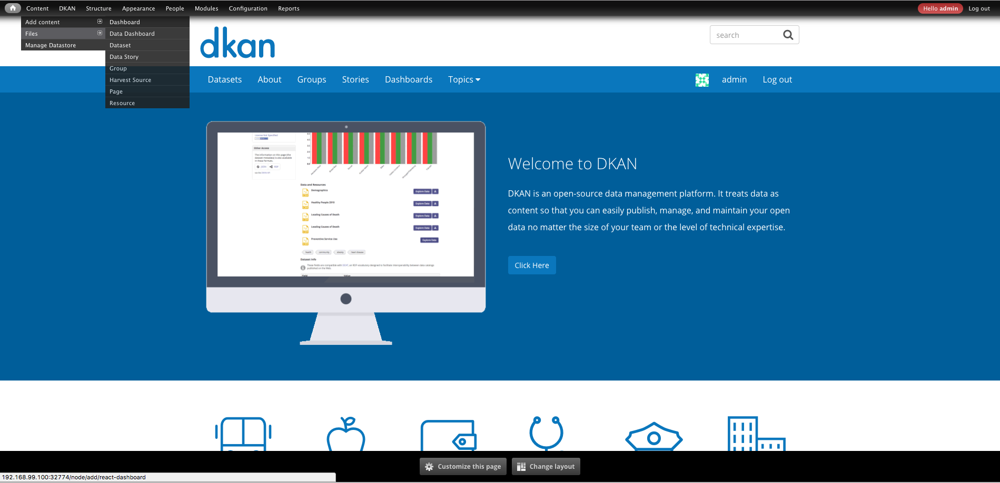
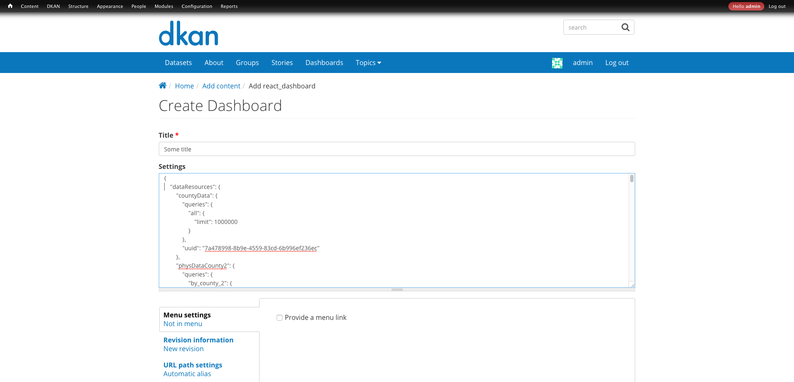

DKAN Dash
==========================

What's dkan_dash
-----------------
It's a module to build dashboards using json as syntax.

Install
-------
``drush en dkan_dash -y``

How to create a new dashboard
-----------------------------

Dashboards are a json representation of the dashboard configuration.

To create a new dashboard:

- Go to ``/node/add/react-dashboard``

- Set a title
- Paste a json object with all the dashboard settings using the react-dash syntax.

General JSON syntax
*******************

.. code-block:: javascript

  {
    "title": 'Some title',
    "dataResources": {...}
    "regions": [...],
    "vars": {},
  }

**DataResources**
A list of resources to be used in the dashboard. Each resource holds a list of queries to be performed against the datastore.

.. code-block:: javascript

  "dataResources": [
    {
      "uuid": "302eeb05-8422-4217-8660-1929bfcaae18",
      "queries": {
        "name_of_the_query": {
          "count": "County",
        },
        "name_of_the_query2": {
          "count": "County2",
        }
      }
    }
  ]

To know more about datastore api query syntax please visit the datastore documentation.

**Regions**

Each region it's an object that represent a region in the layout. This concept it's very similar to drupal regions.

Regions can contain any number of elements. Each element should have a react component counterpart.

Regions looks like this:

.. code-block:: javascript

    "regions": [
      {
        "id": 'someid',
        "className": 'row',
        "children": []
      }
    ]

**Vars**

If you need to hold dashboard wide metadata vars is the right place to do it.

For example:

.. code-block:: javascript

  "vars": {
    "countyField": "WL1 County"
  }

Components
**********
To know more about datastore api query syntax please visit react-dash documentation http://react-dashboard.readthedocs.io/en/latest/development/components/index.html

How to customize dashboards
---------------------------

To customize dashboards you need to enable the custom_dash module: ``drush en custom_dash -y``

Custom dash expose an API to customize dashboards without change DKAN Dash.

Development workflow
********************

All the javascript code inside custom_dash needs to be transpiled in order to be used.

Before start make sure you have node and npm installed by running ``npm`` in the console. Hopefully you will see the list of available commands for npm.

If not, you need to install node before continue: https://nodejs.org/en/download/

To start working in the customizations:

* Go to the custom_dash folder. From the docroot: ``cd profiles/dkan/config/modules/custom/custom_dash``
* Install node dependencies: ``npm install``
* Run ``npm run dev`` to start development process

*Note:* if you need just to perform one change you might want to use ``npm run build`` instead.

There are 3 types of customizations allowed: data handlers, state handlers and css.

Data Handlers
*************

To create custom data handlers you need to create a dataHandlers.js file within the js folder and populate the ``Drupal.settings.dkanDash.dataHandlers`` global with the handlers you want to create.

.. code-block:: javascript

  Drupal.settings.dkanDash.dataHandlers = {
    handler1: function() {
      // data adapt process
    },
    handler2: function() {
      // data adapt process
    },
  }

Once you declare them you can use them inside any component. For example:

.. code-block:: javascript

    {
      "id": "metrics-header-row",
      "className": "row",
      "multi": true,
      "dataHandlers": ["countyMetricMultiSelect"]
    }

State Handlers
**************

*TODO*

Styles
******
To add styles there is a file called custom_dash.css inside the css folder of custom_dash module. Remember use specific selectors to avoid style collisions with other components.

